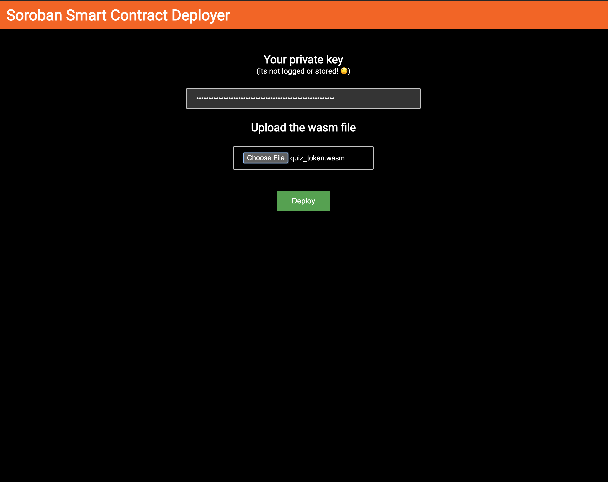

# contract-deployer

contract-deployer is a decentralized application that lets you upload and deploy your Soroban smart contracts.
It provides a graphical UI alternative to the soroban CLI. It essentially performs the two following commmands to deploy your contract:

* `soroban contract install`
* `soroban contract deploy`

It also has a contract for adding contract information under a single app name and fetching contract instances for a particular app.
This can be integrated into the dapp later or used as an example contract to test the deployment capabilities of this project. The
contract provides two methods:

* `deploy`: Accepts a app name, contract ID, metadata about the contract and the time it was deployed at.
* `get_contracts`: Get a list of all the contracts along with their metadata for a particular app.




## Getting Started

### Install Dependencies

While, you need only Node.js v18 or greater to run this app, to build Soroban smart contracts you'll need much more stuff:

* rustc >= 1.71.0 with the wasm32-unknown-unknown target installed. See https://soroban.stellar.org/docs/getting-started/setup#install-rust.
  If you have already a lower version, the easiest way to upgrade is to uninstall (rustup self uninstall) and install it again.
* soroban-cli. See https://soroban.stellar.org/docs/getting-started/setup#install-the-soroban-cli but instead of `cargo install soroban-cli`,
  run `cargo install_soroban`. This is an alias set up in `.cargo/config.toml`, which pins the local soroban-cli to a specific version.
  If you add `./bin` to your `$PATH`, then you'll automatically use this version of soroban-cli when you're in this directory.

### Run the dapp

```
npm install
npm run dev
```

### Contract

To make it easy to interact with Soroban, the project includes a Makefile that has targets for some frequent commands
you might need to use. You can learn the exact Soroban CLI commands by going to the respective Make target.

To build the contract and compile it to a WASM file, run:
```bash
make build
```

Before we can deploy, we need to configure a network to deploy the contract on and create an identity to associate it with:
```bash
make network
make identity
make fund
```

Now we can deploy this WASM file onto the Stellar network:
```bash
make deploy
```
The contract ID must be now present in the `.soroban/contract-deployer-id`. You can confirm this by running:
```bash
cat ./soroban/contract-deployer-id
```

OR

Upload the wasm file and enter your private key on the dapp and let it deploy the contract.

Now invoke the contract:
```
SOURCE=<source> ADDRESS=<address> CALORIES=<calroies> DATE=<date> make invoke-deploy
SOURCE=<source> ADDRESS=<address> CALORIES=<calroies> DATE=<date> make invoke-get-contracts
```
